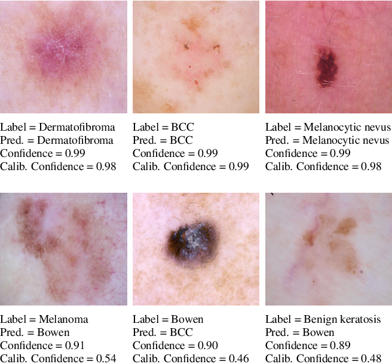

# ATS

However Deep neural networks recently have achieved impressive results for different tasks, they suffer from poor uncertainty prediction. Temperature Scaling(TS) is an efficient post-processing method for calibrating DNNs toward to have more accurate uncertainty prediction. TS relies on a single parameter T which softens the logit layer of a DNN and the optimal value of it is found by minimizing on Negative Log Likelihood (NLL) loss function. In this paper, we discuss about weakness of NLL loss function, especially for DNNs with high accuracy and propose a new loss function called Attended-NLL which can improve TS calibration ability significantly

This code is produced to support paper https://www.catalyzex.com/paper/arxiv:1810.11586

The code is written for combination of DenseNet and CIFAR100 dataset

First run notbook in TrainDenseNet.ipynb to train the model for CIFAR100 dataset, then calibrate the model using the notbook TS_ATS_DenseNet_Cifar_CIFAR100.ipynb to see the results. 

